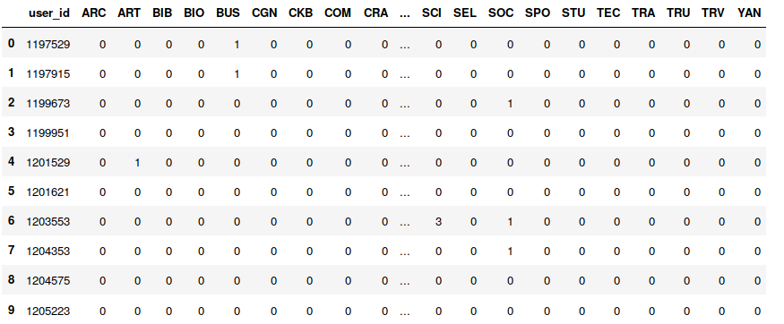

The solution contains the files 'response.csv' file containing user_id of 'psychology', 'education', 'biological and biomedical sciences' for label with 'unknown' value and ones with known value     
There are 2 code notebooks 'Sandbox.html' contains all the basic charts and graphs and also PCA and tSNE code. 'Logistic Regression.html' contains the code for logistic regression model.

### 1. How did you solve the challenge?    

#### 1.1 Aggregating Data Preparation:     
- First of all convert bk_details.json file to table structure and combined it with user_bk_orders to get which user ordered which book     
- I extracted the book type by taking the first 3 characters from book_subject_code    
- I combined the above data with user_bk_orders data and then got the count of each type of book ordered by user in a matrix format as shown below    

     
    
- I combined label, user_profile and above data to form a feature vector of size 53    

#### 1.2 Modelling of Problem:     
- I considered the data with label 'unknown' as the test data and predicted the major for it     
- I used the data with all other labels to train using the feature vector formed before    
- There are many ways to do this but I used simple logistic regression model using one vs rest method to predict the classes got an accuracy of 44.38% using 10 fold cross validation   
- I also applied Naive Bayes, SVM and Decision Tree with default setting of scikit learn just to compare the standing using 5 fold cross validation, the graph is as follows:      

### 2. How did you explore the dataset? What exploratory analysis did you compute? Please include 2-3 figures that were helpful. 
Checking the Gender distribution across majors there was no significant bias as seen below   
   

Let us have a look at the gpa distribution, segregated by major if the gpa distribution is significantly different than other then this can be an important feature. In this case there is almost an overlap of the GPAs indicating no significant difference     
     

After forming the feature vector I visualized the 3 Principal Components to get an idea if reducing the dimensionality will be benefecial. We can see that one class is somewhat seperable in 3 dimensional PCA plot but other classes are not seperable. The first 3 PCs capture 38.93% of the variance of the whole dataset. 
    

A more advanced technique for dimensionality reduction t distributed stochastic neighbor embedding(tSNE). In this output we can see that some classes are clustered but they are not spherical, if we use density based clustering technique like DBSCAN we can get significant results.    

### 3. Did you make use of the book details or user profile datasets? If so, which fields were most useful? Please explain. 

Yes I used book details and profile datasets. Book details were used to get the data about the number of books ordered by the user for each book type as shown in matrix in section 1.1. Profile dataset was used to get the gender and gpa of the user.  

### 4. How do you know your response is correct?    
I trained a logistic regression model and did 10 fold cross validation on the training data which gave me an accuracy of arround 44% for 7 class classification problem. So if the test data follows the same properties as the train data then I would be right 44% of the times approximately. The majority class is 'psychology' which consists of 26% of the training data so the accuracy is better than 26%, the accuracy can further be improved if I get more time to try new embedding techniques and using better model.  

### 5. What assumptions did your solution make? When would it fail? Given the data that we shared with you, would your approach always generalize?    
My Basic general assumption was that both the data with unknown label and the ones with known label are drawn from same population, so that the model can generalize well over the test data.    
It would definately fail if it does not satisfy this criteria and has no sufficient information of books ordered.      
If we get a similar data as we got on this task the approach would generalize as I have tried to avoid overfitting of the data using cross validation as well as used l1 regularization for the data.     

### 6. How would your approach change if students had a variable number of majors? For example, some users may not have a major yet, and some users may have several. Please explain a sketch of a solution in detail, but no code is needed to support your argument.   
If a student has variable number of majors then we can treat this problem as multi label classification problem, there are multiple approaches we can apply one of them is listed below.
- Generate multiple labels for each example where one example can belong to multiple classes.    
- apply One vs Rest classifier to get the probabilities of all the classes using any machine learning algorithm or use soft clustering to get the score for each cluster. We can also use ensemble approach by training seperate classifier for each class.      
- order the probabilities in descending order and get the inter class delta for consecutive probabilities and get a threshold t such that       
if $$P[C_i]>t$$ and $$P[C_j]>t$$     
and $$P[C_i] - P[C_j] < \delta$$ then,    
the record belongs to both class $i$ and $j$     
the values of $t$ and $\delta$ can be learned from the training data by observing the actual classes.     

The approach mentioned above might not apply in all cases but will be useful in most of the cases.

